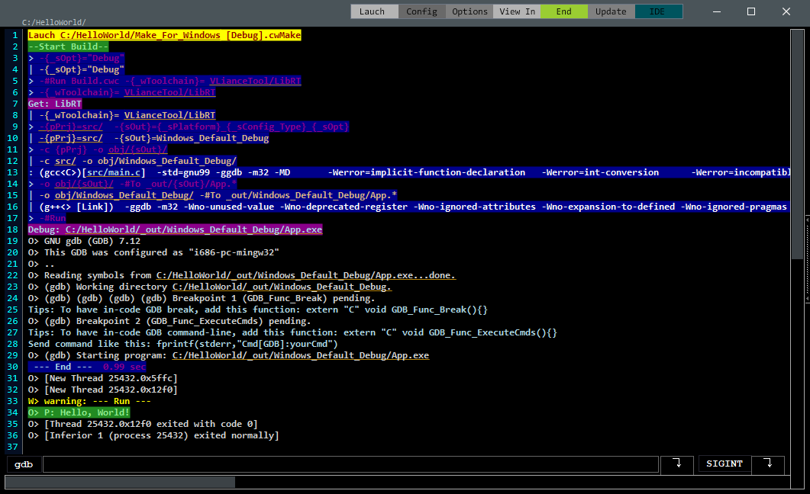

# HelloWorld

 

## How to build
-Grab the last [Cwc](https://github.com/VLiance/Cwc) Release

-Open the executable, the first use it will asscociate **.cwMake** files. *The menu "Config/Set cwc" do the same thing.*

-Download this repo. Some **.cwMake** is avalaible under the cwc folder. Double click on it, the *Toolchains* will be automatically downloaded, then compiled.

***
